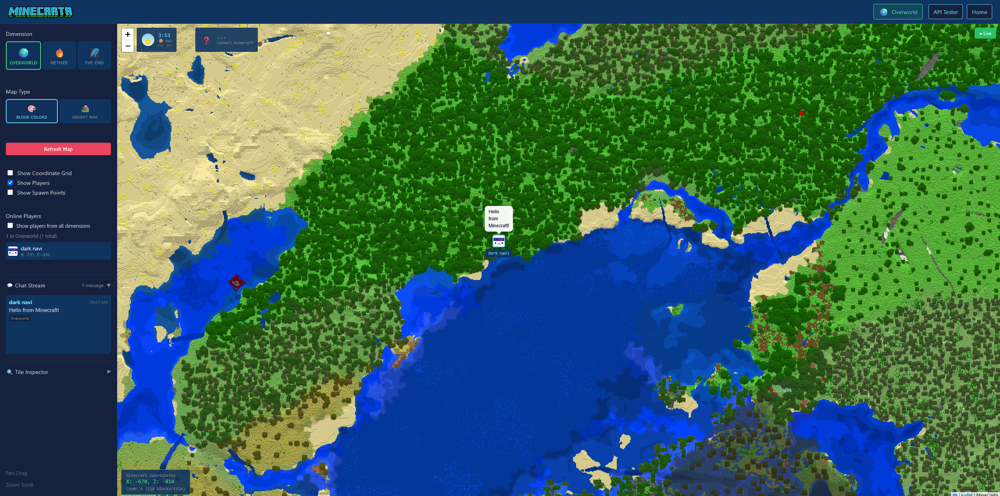

# MineCarta

<p align="center">
  
</p>

> ⚠️ **Work in Progress** - This project is under active development. Most features are not yet implemented.

> 🔓 **Security Notice** - The web server component of this project does not implement authentication or authorization mechanisms. It is intended for use in trusted local network environments only. Please do not expose this server directly to the public internet, as doing so may result in unauthorized access to your world data.

A real-time web-based map visualization for Minecraft Bedrock Edition worlds. This project captures world state data from a Minecraft behavior pack and displays it through an interactive Google Maps-like interface.

## Overview

The project consists of two main components:

- **Minecraft Behavior Pack** - A TypeScript-based behavior pack that monitors world state (player positions, blocks, structures) and sends data to an external server via HTTP
- **Map Web Server** - A TypeScript web server that receives world data, stores it in a database, and serves a real-time map visualization using Leaflet.js

## Project Structure

```
packages/
├── behavior-pack/    # Minecraft Behavior Pack (TypeScript)
├── server/           # Web Server (Fastify + WebSocket)
└── shared/           # Shared types & utilities
```

## Features

- Pan/zoom map navigation
- Real-time player position tracking
- Layer controls for terrain and players
- WebSocket-based live updates

## Screenshots


